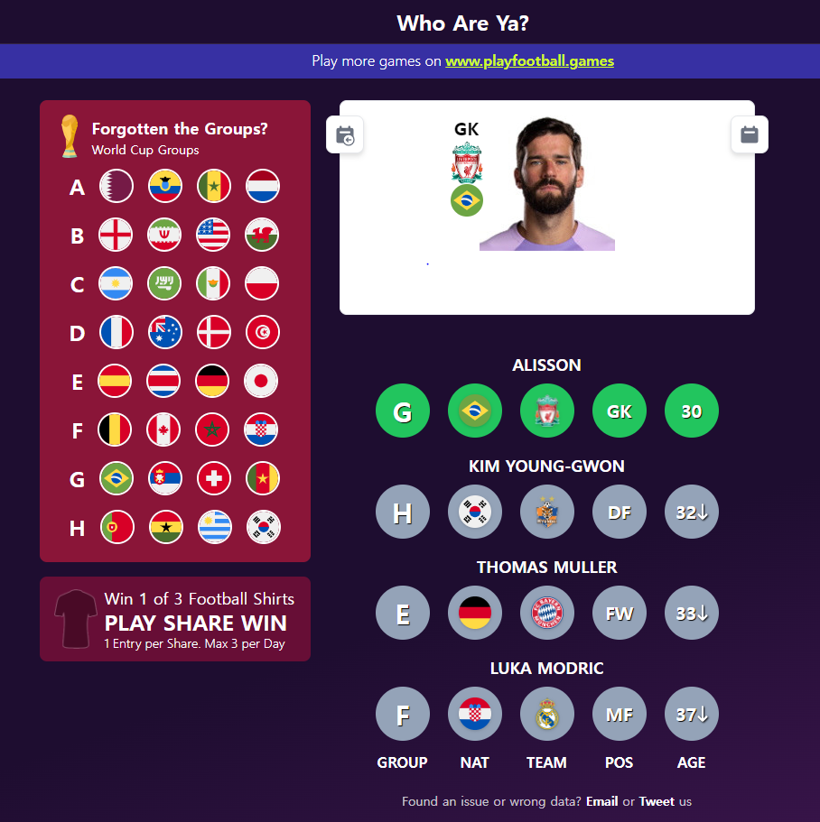

# Find a football player game

## Stack

- react
- react-query
- recoil
- styled-components
- media query
- react-helmet

## Screen

### Actions

#### Loading


#### Playing


## How to play

### Requirement

```
- 좌측 상단 element에서 클럽 data의 loading이 끝나고 클럽 앰블럼이 나타날 때까지 기다린다
- 우측의 element에서 선수 data의 loading이 끝나고 'Game Start' 문자가 나타날때까지 기다린다.
```

1. 'Game Start' 버튼을 누르면 임의의 선수를 생성한다

   a. 커버가 사라지고 블러처리된 이미지와 입력창이 나타난다

2. 사용자는 선수 이름을 입력한다

   a. 선수 이름의 일부를 입력하면 차동완성창이 나타난다.

3. 자동완성창에서 선수를 클릭하면 입력창에 해당 선수의 이름이 입력된다
4. 정답이면 블러처리된 이미지가 깨끗하게 나타나고,
   정답이 아니면 입력한 선수의 정보를 기반으로 힌트를 제공한다

### 참고 사이트

[Who are ya!](https://playfootball.games/who-are-ya/world-cup)


